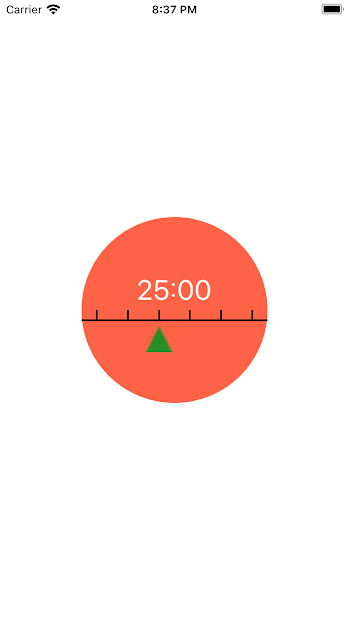

# Tomato Timer

Welcome to Tomato Timer (currently registered as Simple Interval Timer on the google play store), a gesture based interval timer app that encourages you to take breaks at regular intervals.

- swipe right and left to increase and decrease timer
- start and stop the timer
- reset the timer
- visual feedback of the timers progress with a green triangle
- celebrate your break with sound effects!

## See the Project
- Web: https://simple-pomodoro-timer.netlify.app/
- Android: https://play.google.com/store/apps/details?id=com.brooklinjazzmyers.pomodoro
- IOS: Not Yet Deployed

## Getting Started
Tomato timer is built using React Native and is intended to work on ios, android, and web

if you want to run the project locally, first clone the repo then:

install dependencies
```
yarn install
```

on web
```
yarn web
```

on ios
```
yarn ios
```

on android
```
yarn android
```

